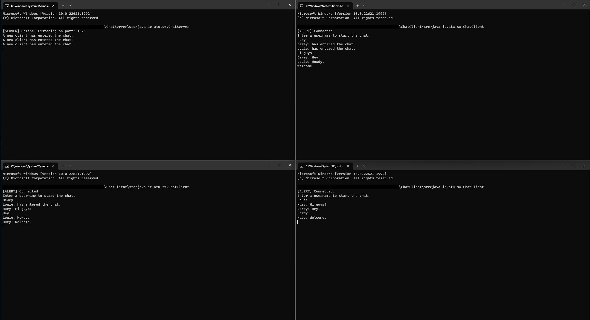
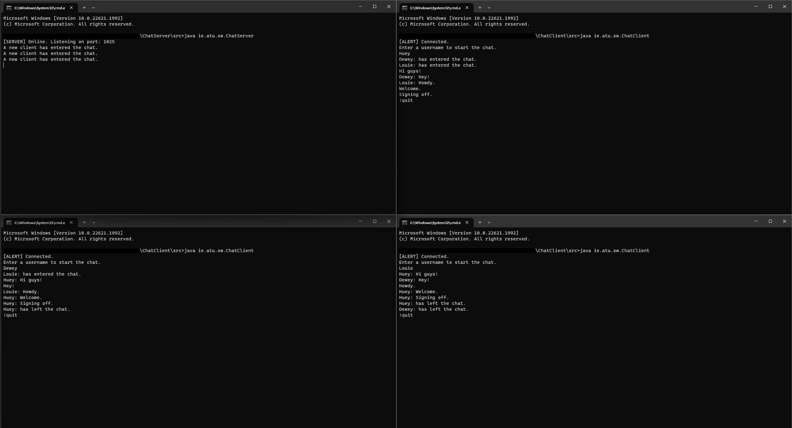

# NetworkTechnologies
 
Network Technologies Project - A chat server & client written in Java.

Demonstration of Server and multiple clients in operation. Server handles multiple client connections simultaneously using threads.

This project was intended to demonstrate how to use the Socket class in Java to communicate over networks. The arrangement consists of two programs, a server and a client. The server program creates a server socket and listens on a designated port for incoming connections from clients. The server program uses threads to facilitate multiple chat clients simultaneously. Upon entering the chat, clients are prompted to enter a username, then they can transmit messages via the server. When a user wants to leave the chat, they can use the command "!quit" to exit, and other users are notified.

---

**Instructions:**

_Note: Java version 19 or later required._

Server:

* Navigate to the src directory of the ChatServer program.
* Compile using the following command: "javac ie\atu\sw\ChatServer.java".
* Run using the following command: "java ie.atu.sw.ChatServer".
* Server is now running, port number is shown in console.

Client:

* Navigate to src directory of the ChatClient program.
* Compile using the following command: "javac ie\atu\sw\ChatServer.java".
* Run using the following command: "java ie.atu.sw.ChatClient"
* You are now connected, enter a username to begin.
* Repeat steps above to add another user to chat. Now messages can be transmitted to all users present.
* To leave the chat, use the command: "!quit".
---

**Demonstration:**

Clients communicating simultaneously:

Clients leave the chat by typing "!quit":

